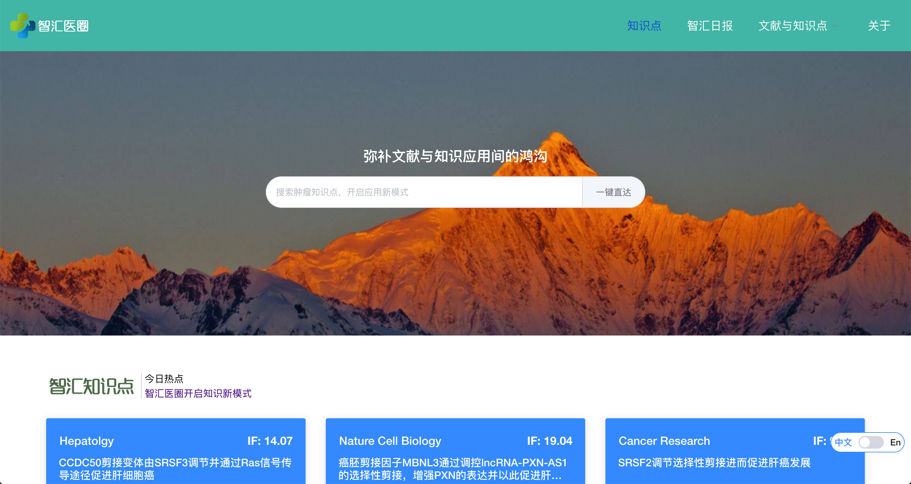

<div align="center">
  
</div>

# Prophet

Prophet is an open source text annotation tool for biomedical researchers. It provides annotation features for text classification, sequence labeling and sequence to sequence tasks. So, you can create labeled data for sentiment analysis, named entity recognition, text summarization and so on. Just create a project, upload data and start annotating. You can build a dataset in hours.

## Demo

You can try the [annotation demo](http://prophet.3steps.cn).

## Features

-   Collaborative annotation
-   Multi-language support
-   Mobile support
-   Emoji :smile: support
-   Dark theme
-   RESTful API

## Usage

Two options to run prophet:

-   (Recommended) Docker Compose
-   Docker

### Docker Compose

```bash
$ git clone https://github.com/clinico-omics/prophet.git
$ cd prophet
$ docker-compose -f docker-compose.prod.yml up
```

Access <http://0.0.0.0/>.

_Note the superuser account credentials located in the `docker-compose.prod.yml` file:_
```yml
ADMIN_USERNAME: "admin"
ADMIN_PASSWORD: "password"
```

## Build & Test & Deploy

Run whole program by using docker-compose.
```bash
$ git clone https://github.com/clinico-omics/prophet.git
$ cd prophet
$ docker-compose -f docker-compose.prod.yml up
```

You can test it interactively, then if it is valid, you can follow the steps.
```bash
$ TAG=Your Tag
$ REF=`TEMP=$(git rev-parse HEAD) && echo ${TEMP:0:8}`
$ docker tag prophet_backend prophet-backend:${TAG}-${REF}
$ docker tag prophet_frontend prophet-frontend:${TAG}-${REF}
$ docker tag prophet_nginx prophet-nginx:${TAG}-${REF}
```

## Contribution

As with any software, doccano is under continuous development. If you have requests for features, please file an issue describing your request. Also, if you want to see work towards a specific feature, feel free to contribute by working towards it. The standard procedure is to fork the repository, add a feature, fix a bug, then file a pull request that your changes are to be merged into the main repository and included in the next release.

## Contact

For help and feedback, please feel free to contact [the author](https://github.com/yjcyxky).
